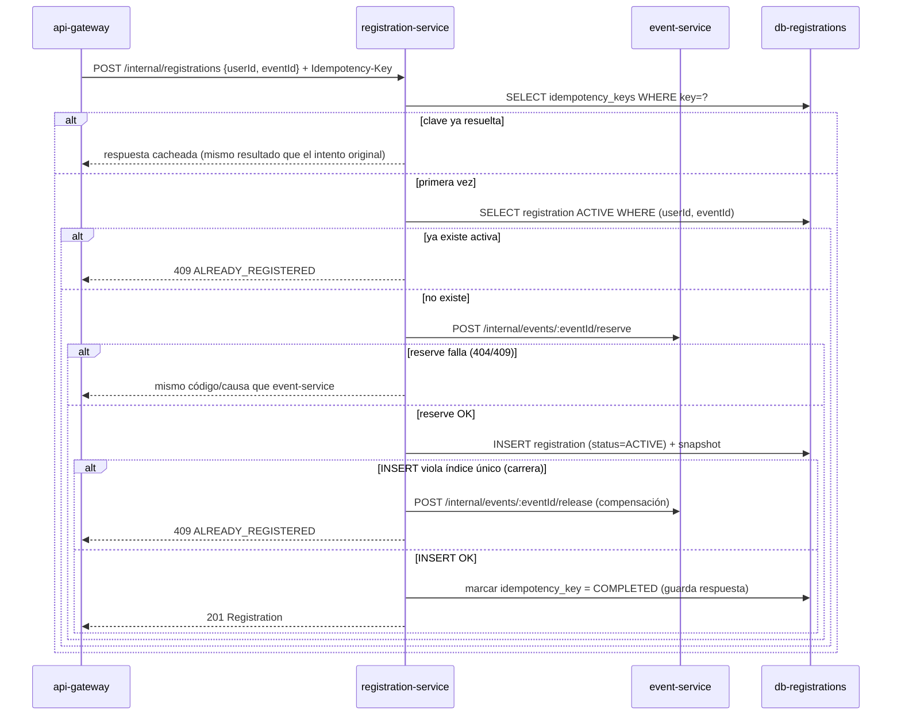

# Contrato interno: registration-service

**Alcance**: accesible desde `api-gateway`. Es el único servicio que además
actúa como cliente de otro microservicio (`event-service`, endpoints
`reserve`/`release`), autorizado explícitamente por `NetworkPolicy` y
`X-Internal-Token`. Base path: `/internal`.

| Método | Ruta | Headers/Body | Éxito | Errores |
|---|---|---|---|---|
| POST | `/internal/registrations` | `Idempotency-Key`; body `{userId, eventId}` | `201 Registration` | `404 EVENT_NOT_FOUND`, `409 {ALREADY_REGISTERED\|CAPACITY_EXCEEDED\|EVENT_ALREADY_STARTED}` |
| GET | `/internal/registrations?userId=&status=` | — | `200 [Registration]` | `400 VALIDATION_ERROR` |
| GET | `/internal/registrations/:id` | — | `200 Registration` | `404 NOT_FOUND` |
| DELETE | `/internal/registrations/:id` | body `{userId}` (quién solicita) | `200 Registration` (`status=CANCELLED`) | `403 FORBIDDEN`, `404 NOT_FOUND`, `409 EVENT_ALREADY_STARTED` |
| GET | `/internal/events/:eventId/registrations?status=` | — | `200 [{id,userId,status,createdAt,cancelledAt}]` | `400 VALIDATION_ERROR` |
| GET | `/internal/healthz` / `/internal/readyz` | — | `200` | `503` |

`Registration`: `{id, userId, eventId, status, createdAt, cancelledAt, eventNameSnapshot, eventStartsAtSnapshot, eventLocationSnapshot}`.

## Flujo de creación (`POST /internal/registrations`) — orquesta el invariante de cupo

- El `INSERT` con conflicto de carrera es el caso donde dos solicitudes
  simultáneas para el **mismo usuario y mismo evento** (no el mismo cupo)
  pasan la verificación previa; el índice único parcial
  `(user_id, event_id) WHERE status='ACTIVE'` (ver `data-model.md`) es la
  garantía final de BR-001.
- Si el `INSERT` falla por una causa transitoria distinta (timeout de base
  de datos), `registration-service` también compensa con `release`, marca
  la clave de idempotencia como `FAILED` (permite reintento del cliente) y
  devuelve `503` con indicación de reintentar (E-007).

## Flujo de cancelación (`DELETE /internal/registrations/:id`)

1. Verifica que la inscripción exista y pertenezca a `userId` (FR-020) →
   si no, `403 FORBIDDEN` (o `404` si el id no existe).
2. `UPDATE registrations SET status='CANCELLED', cancelled_at=now() WHERE id=$1 AND status='ACTIVE' RETURNING *`.
   - 1 fila afectada → continúa a (3).
   - 0 filas afectadas porque `status` ya era `CANCELLED` → responde `200`
     con el estado actual (cancelación idempotente, sin error — evita el
     caso límite de doble clic dejando "un estado consistente").
   - 0 filas afectadas porque no existe → `404 NOT_FOUND`.
3. Verifica `eventStartsAtSnapshot > now()` (BR-003); si el evento ya
   comenzó, revierte el `UPDATE` (transacción) y responde
   `409 EVENT_ALREADY_STARTED`.
4. Llama `POST /internal/events/:eventId/release` en `event-service`.
5. Responde `200 Registration` con `status=CANCELLED`.

## Errores devueltos tal cual desde `event-service`

`CAPACITY_EXCEEDED`, `EVENT_ALREADY_STARTED` y `NOT_FOUND` (renombrado
`EVENT_NOT_FOUND`) se propagan sin modificar el significado, para que el
Gateway y el frontend usen el mismo catálogo de códigos en toda la
aplicación (`contracts/api-gateway.md`).
