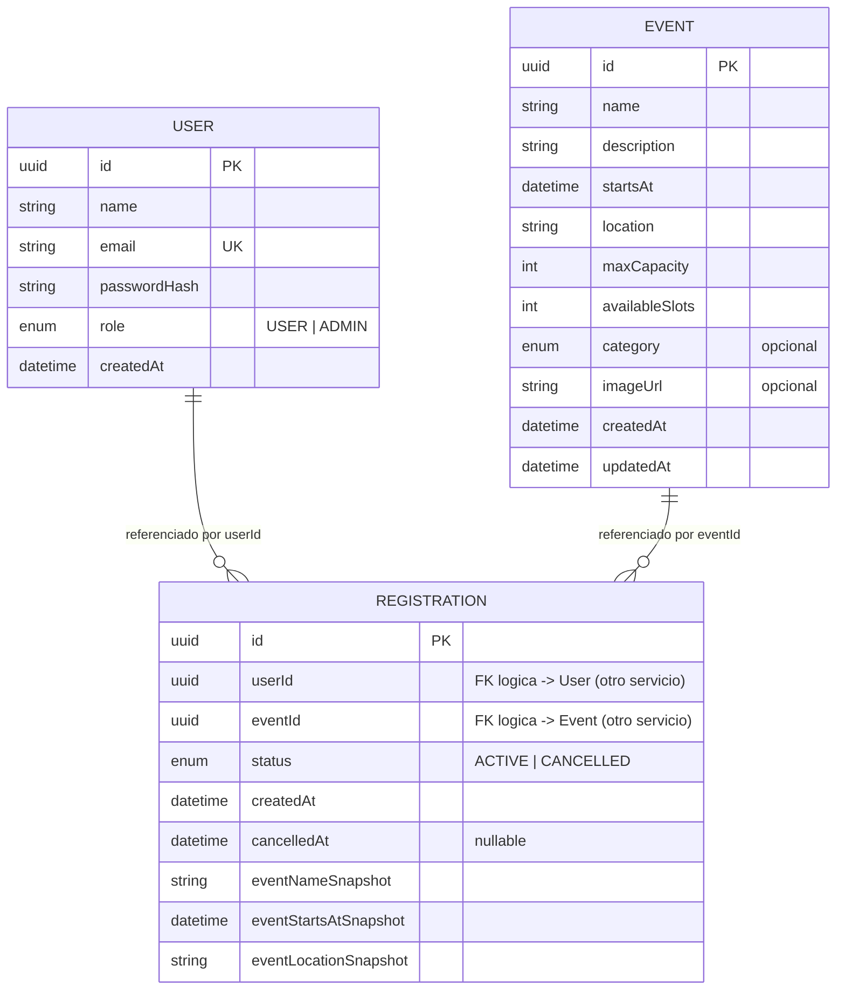
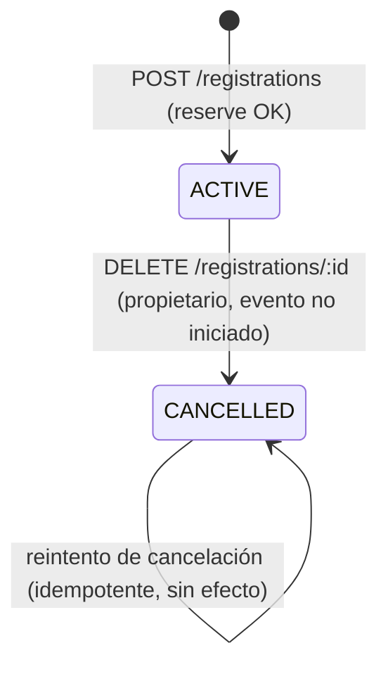

# Data Model: Event Hub

**Feature**: `001-event-hub-management` | Deriva de `spec.md` § Key Entities +
decisiones de `research.md` §§ 4, 5, 15, 20, 21.

Principio rector: **cada entidad vive en la base de datos de un único
microservicio**. No hay claves foráneas entre bases de datos distintas; las
referencias cruzadas se resuelven por **ID + snapshot desnormalizado** (en
`Registration`) o por **llamada REST en tiempo de lectura desde el API
Gateway** (para el panel administrativo), nunca por acceso directo a otra
base de datos.

## Propiedad de datos por servicio

| Base de datos | Servicio propietario | Entidades |
|---|---|---|
| `db-users` | `user-service` | `User` |
| `db-events` | `event-service` | `Event` |
| `db-registrations` | `registration-service` | `Registration`, `IdempotencyKey` |

## Diagrama de entidades (por servicio, sin FK cruzadas)

---

## Entidad: `User` (propiedad de `user-service`)

| Campo | Tipo | Restricciones | Origen |
|---|---|---|---|
| `id` | UUID | PK, generado por servicio | — |
| `name` | string | obligatorio, no vacío | FR-001 |
| `email` | string | obligatorio, único, formato válido (V-006) | FR-001, FR-003, V-006 |
| `passwordHash` | string | bcrypt (cost ≥ 12); nunca expuesto en API (NFR-014) | FR-001, V-007 |
| `role` | enum(`USER`,`ADMIN`) | por defecto `USER`; `ADMIN` solo vía *seed* (research.md §19) | FR-005 |
| `createdAt` | datetime | asignado por servicio | Key Entities |

**Validaciones**: `email` único a nivel de índice de base de datos (además de
verificación aplicativa) para que una condición de carrera en el registro no
produzca dos cuentas con el mismo correo (V-006, FR-003, E-009).
`password` en tránsito (payload de registro) nunca se persiste en claro; solo
`passwordHash` se guarda.

**Transiciones de estado**: ninguna (cuenta activa desde su creación; no hay
suspensión/eliminación de cuentas en este alcance).

---

## Entidad: `Event` (propiedad de `event-service`)

| Campo | Tipo | Restricciones | Origen |
|---|---|---|---|
| `id` | UUID | PK | — |
| `name` | string | obligatorio, no vacío (V-001) | BR-006, FR-023 |
| `description` | string | obligatorio, no vacío (V-002) | BR-006, FR-023 |
| `startsAt` | datetime | obligatorio; al crear/actualizar debe ser `> now()` (V-003, BR-007) | FR-024 |
| `location` | string | obligatorio, no vacío (V-004) | BR-006, FR-023 |
| `maxCapacity` | int | obligatorio, entero `> 0` (V-005, FR-025) | BR-006 |
| `availableSlots` | int | `= maxCapacity − inscripciones activas` (BR-010); columna materializada, actualizada atómicamente por `reserve`/`release`/edición de capacidad | BR-004, BR-010 |
| `category` | enum opcional | `music`,`art`,`food`,`community`,`workshop`,`other`; por defecto `other` | Extensión UX (research.md §20) |
| `imageUrl` | string opcional | URL; si ausente, frontend usa ilustración de reemplazo por `category` | Extensión UX (research.md §20) |
| `createdAt` / `updatedAt` | datetime | gestionados por servicio | — |

**Campo derivado (no persistido)**: `temporalStatus` (`upcoming` \|
`ongoing` \| `finished`), calculado en tiempo de lectura según
`research.md §21`. No se guarda en base de datos porque depende de `now()`.

**Validaciones**:
- `V-005` / BR-011: al actualizar `maxCapacity`, el nuevo valor DEBE ser
  `≥ (maxCapacity_actual − availableSlots_actual)` (= inscripciones activas
  actuales). Si no se cumple → `409 CAPACITY_BELOW_ACTIVE_REGISTRATIONS`
  (código consistente con `contracts/event-service.md` y
  `contracts/api-gateway.md`).
  Al aceptarse, `availableSlots` se ajusta por delta:
  `availableSlots_nuevo = availableSlots_actual + (maxCapacity_nuevo − maxCapacity_actual)`.
- `V-003` / BR-007: crear o reprogramar con `startsAt ≤ now()` → `400`.

**Invariante crítica**: `0 ≤ availableSlots ≤ maxCapacity` en todo momento.
Se preserva porque `reserve`/`release` son las únicas rutas de escritura de
`availableSlots` y ambas usan `UPDATE ... WHERE` condicional (ver
`contracts/event-service.md`).

**Transiciones de estado (derivado, solo lectura)**:

```mermaid
stateDiagram-v2
    [*] --> upcoming: now < startsAt
    upcoming --> ongoing: startsAt <= now < startsAt+3h
    ongoing --> finished: now >= startsAt+3h
    upcoming --> finished: (evento eliminado antes de comenzar no aplica; solo temporal)
```

**Eliminación**: borrado físico de la fila `Event`. Las filas de
`Registration` en `registration-service` que apuntaban a ese evento **no se
eliminan** (se conservan por trazabilidad, Assumptions de `spec.md`); su
`eventNameSnapshot`/`eventStartsAtSnapshot`/`eventLocationSnapshot`
permiten seguir mostrándolas en "Mis inscripciones" aunque el evento ya no
exista (mitiga E-006 sin una llamada de lectura entre servicios en cada
listado).

---

## Entidad: `Registration` (propiedad de `registration-service`)

| Campo | Tipo | Restricciones | Origen |
|---|---|---|---|
| `id` | UUID | PK | — |
| `userId` | UUID | referencia lógica a `User`; no hay FK física | Key Entities |
| `eventId` | UUID | referencia lógica a `Event`; no hay FK física | Key Entities |
| `status` | enum(`ACTIVE`,`CANCELLED`) | ver transición abajo | Key Entities |
| `createdAt` | datetime | asignado al crear | — |
| `cancelledAt` | datetime, nullable | asignado al cancelar | Key Entities |
| `eventNameSnapshot` | string | copiado de `Event.name` al crear | Decisión de resiliencia de lectura |
| `eventStartsAtSnapshot` | datetime | copiado de `Event.startsAt` al crear | idem |
| `eventLocationSnapshot` | string | copiado de `Event.location` al crear | idem |

**Restricción crítica (BR-001)**: índice único parcial
`UNIQUE (user_id, event_id) WHERE status = 'ACTIVE'`. Garantiza a nivel de
base de datos que un usuario no puede tener dos inscripciones activas al
mismo evento, incluso si dos solicitudes concurrentes pasan la verificación
previa en la capa de aplicación (cierra la ventana de carrera que un simple
`SELECT` + `INSERT` dejaría abierta).

**Transiciones de estado**:

Una inscripción `CANCELLED` nunca vuelve a `ACTIVE`; para volver a asistir el
usuario crea una inscripción nueva (si hay cupo).

---

## Entidad de soporte: `IdempotencyKey` (propiedad de `registration-service`)

| Campo | Tipo | Notas |
|---|---|---|
| `key` | string | PK, UUID generado por el cliente, cabecera `Idempotency-Key` |
| `userId` | UUID | para evitar colisión entre usuarios con la misma clave |
| `status` | enum(`PENDING`,`COMPLETED`,`FAILED`) | `PENDING` mientras se resuelve `reserve` |
| `responseBody` | JSON, nullable | resultado cacheado a devolver en reintentos |
| `createdAt` | datetime | usado para purgar claves antiguas (TTL operativo, no funcional) |

No es una entidad de negocio visible al usuario; existe únicamente para
sostener `research.md §5` (reintentos seguros tras pérdida de conexión).

---

## Reglas de negocio → validaciones → entidades (trazabilidad)

| Regla | Entidad(es) | Mecanismo |
|---|---|---|
| BR-001 (una inscripción activa por usuario/evento) | `Registration` | índice único parcial + verificación previa en servicio |
| BR-002 (no inscribir sin cupo) | `Event`, `Registration` | `UPDATE ... WHERE available_slots > 0` en `reserve` |
| BR-003 (cancelar antes de iniciar) | `Registration`, `Event` | `registration-service` verifica `eventStartsAtSnapshot > now()` antes de cancelar |
| BR-004 (recalcular cupos al crear/cancelar) | `Event` | `reserve`/`release` atómicos |
| BR-006 (campos obligatorios de evento) | `Event` | validación DTO (`class-validator`) + restricciones NOT NULL en esquema |
| BR-007 (fecha futura) | `Event` | validación DTO + comprobación en `event-service` |
| BR-008 (no inscribir a evento iniciado) | `Event` | `reserve` incluye `AND starts_at > now()` |
| BR-009 (mensajes de error específicos) | todas | envolvente de error uniforme (`contracts/api-gateway.md`) |
| BR-010 (cupos = capacidad − activas) | `Event` | columna materializada `availableSlots`, nunca calculada por conteo en caliente |
| BR-011 (no reducir bajo inscritos activos) | `Event` | validación en `PUT /internal/events/:id` |
