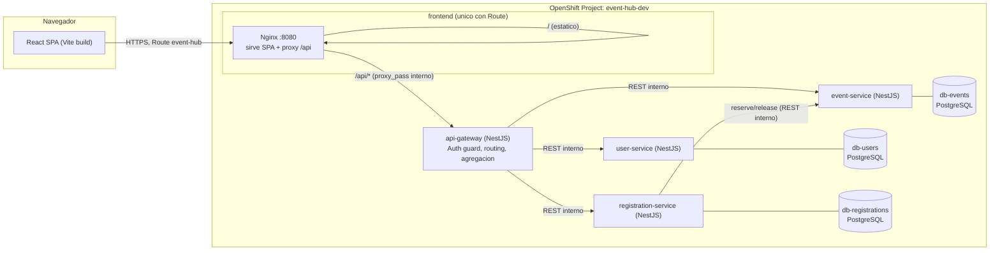

# Implementation Plan: Event Hub — Gestión de Eventos e Inscripciones

**Branch**: `main` (este repositorio publica directamente en `main`; no se
usan ramas de feature — ver `docs/development/spec-kit.md` y `AGENTS.md`)
**Date**: 2026-09-07
**Spec**: [spec.md](./spec.md) · **Feature**: `001-event-hub-management`
**Gobernanza**: constitución organizacional `1.2.0` (inmutable, gobierna
todo el ciclo SDD del repositorio) · preset `redhat-openshift-sdd` `0.4.0`
· perfil `openshift-dev` (`delivery.mode: orchestrated`,
`topology: multi-workload`)

**Input**: preferencias tecnológicas y de arquitectura suministradas
explícitamente por el desarrollador en el prompt de `plan` (microservicios,
React/TS/Vite, Node/TS/NestJS, API Gateway, PostgreSQL por servicio,
Docker/OpenShift/Tekton/Argo CD) más los 31 puntos de arquitectura, 16
pantallas y dirección visual bohemia solicitados en la misma entrada.

## Resumen

Event Hub se implementa como cinco *workloads* desplegables de forma
independiente — `frontend` (React/TS/Vite servido por Nginx),
`api-gateway`, `user-service`, `event-service` y `registration-service`
(los cuatro backend en NestJS/TS) — más tres bases PostgreSQL propietarias
(`db-users`, `db-events`, `db-registrations`), una por servicio. El
frontend solo habla con `api-gateway` (único punto de entrada, mismo
origen, sin CORS); `api-gateway` es el único componente con `Route`
externa. La invariante de negocio más sensible — nunca sobrepasar la
capacidad de un evento bajo concurrencia (SC-004) — se resuelve con una
actualización SQL condicional atómica en `event-service` más un patrón
*reserve-then-confirm con compensación* orquestado por
`registration-service`, sin locks distribuidos ni infraestructura
adicional (`research.md §4`). El repositorio declara su topología en
`.sdd/workloads.yaml` y sus manifiestos en `deploy/openshift/`; el SDD
Orchestrator (modo `orchestrated`) construye, publica por digest y
reconcilia vía GitOps — este repositorio no contiene `Pipeline`,
`PipelineRun` de build ni `Application` Argo CD.

## Technical Context

**Language/Version**: TypeScript 5.x sobre Node.js 20 LTS (backend) y
React 18 + TypeScript 5.x (frontend).

**Primary Dependencies**: NestJS 10 (`@nestjs/common`, `@nestjs/config`,
`@nestjs/jwt`, `@nestjs/throttler`, `@nestjs/swagger`, `@nestjs/axios`),
Prisma ORM 5.x, `class-validator`/`class-transformer`, `bcrypt`; React
Router 6, TanStack Query 5, React Hook Form + Zod, Tailwind CSS 3,
`lucide-react`, Vite 5.

**Storage**: PostgreSQL 16, una instancia (`StatefulSet`) por
microservicio con datos (`db-users`, `db-events`, `db-registrations`).
`api-gateway` y `frontend` son *stateless*.

**Testing**: Jest + Supertest (backend, unitario/integración/contrato);
Vitest + React Testing Library (frontend, unitario/componente); Playwright
(E2E del flujo dorado y flujos administrativos críticos). Ver
`research.md §14`.

**Target Platform**: contenedores Linux en Red Hat OpenShift (namespace
`event-hub-dev`), compatibles con UID arbitrario y ejecución sin
privilegios.

**Project Type**: aplicación web de microservicios (frontend + API
Gateway + 3 servicios de dominio), "Option 2 — Web application" adaptada a
múltiples backends.

**Performance Goals**: NFR-017 (acciones principales con latencia
comparable a una SPA moderna, sin objetivo numérico contractual — no se
declaró SLA); SC-002 (cupos reflejados en ≤ 2s tras una inscripción o
cancelación, cumplido de forma natural porque la escritura es síncrona y
la UI revalida inmediatamente vía TanStack Query).

**Constraints**: sin pagos, sin notificaciones externas, sin SSO de
terceros, sin listas de espera, un idioma (español) — todo por alcance
excluido en `spec.md`. Recursos de clúster modestos por defecto (perfil
`dev`, sin objetivo de escala declarado).

**Scale/Scope**: 16 pantallas, 3 dominios de datos, 4 servicios backend +
1 frontend, 6 historias de usuario (P1–P6). Sin objetivo cuantitativo de
usuarios concurrentes declarado (`spec.md` Assumptions) más allá de
SC-004 (100 intentos concurrentes sobre un mismo evento).

## Constitution Check

*Gate evaluado antes de la Fase 0 y re-evaluado tras el diseño de la Fase 1.*

| Principio | Evaluación | Estado |
|---|---|---|
| I. La especificación es la fuente funcional | Cada componente y decisión de este plan traza a un FR/BR/NFR de `spec.md` o a una extensión aditiva documentada con motivo (`research.md §20-21`) | PASS |
| II. Entrega autónoma con responsabilidades separadas | El repositorio no crea `Pipeline`/`Application` propios; delega en el SDD Orchestrator vía `.sdd/workloads.yaml` (modo `orchestrated`) | PASS |
| III. Diseño derivado de la arquitectura real | 5 workloads + 3 bases derivan directamente de los 3 dominios de datos y la restricción explícita de aislamiento por microservicio; ninguno es especulativo | PASS |
| IV. OpenShift seguro por defecto | Todos los workloads: `runAsNonRoot`, sin capacidades, sin escalado de privilegios, recursos declarados, solo `frontend` expone `Route` (ver § Seguridad) | PASS |
| V. Entrega declarativa, determinista y gobernada | Imágenes por digest, un build por commit, promoción vía GitOps — todo delegado y descrito en § CI/CD | PASS |
| VI. Datos y operabilidad forman parte del producto | Backup/retención definidos en § Datos; migraciones Prisma versionadas | PASS |
| VII. Portabilidad entre organizaciones mediante perfiles | Sin nombres de organización/cluster hardcodeados en manifiestos; todo vía `ConfigMap`/perfil | PASS |

**Resultado**: sin violaciones que requieran excepción. Una decisión de
*trade-off* deliberado (3 bases de datos separadas en vez de 1 instancia
compartida) se documenta en § Complexity Tracking porque consume más
recursos de clúster que la alternativa más simple, no porque incumpla la
gobernanza vigente.

---

## 1. Contexto, alcance y versión de gobernanza

Alcance: las 6 historias de usuario (P1–P6) de `spec.md`, íntegramente.
Sin alcance adicional. Gobernanza aplicada: constitución organizacional
`1.2.0`, preset `redhat-openshift-sdd` `0.4.0`. El Project OpenShift
objetivo es `event-hub-dev` (declarado en `docs/product-context.md`),
aprovisionado por el Namespace Provisioner antes de la primera entrega.

## 2. Resumen de arquitectura y diagrama



Único punto de entrada externo: la `Route` `event-hub` → `Service`
`frontend`. Ningún otro `Service` tiene `Route`. La única comunicación
servicio-a-servicio fuera del Gateway es `registration-service → event-service`
(`reserve`/`release`), justificada en `research.md §4` porque es la única
forma de mantener la verdad de capacidad en un solo lugar sin acceso
compartido a base de datos ni infraestructura de mensajería.

## 3. Trazabilidad requisito → componente → prueba

| Requisito(s) | Componente(s) responsables | Evidencia de prueba |
|---|---|---|
| US1, FR-006..010, NFR-007..009 | `event-service`, `api-gateway`, `frontend` (Catálogo/Detalle) | Playwright E2E "explorar y ver detalle"; Jest contrato `GET /internal/events*` |
| US2, FR-001..005, NFR-014..015 | `user-service`, `api-gateway` | Jest unit (hash, JWT), Supertest `POST /internal/users*`, Playwright "registro + login" |
| US3, BR-001..002, BR-004, BR-008, FR-011..015, SC-004 | `registration-service`, `event-service` | Jest integración de concurrencia (`reserve.concurrency.spec.ts`), Supertest flujo de creación |
| US4, BR-003, FR-016..021 | `registration-service`, `frontend` (Mis inscripciones) | Supertest cancelación, Playwright "cancelar inscripción" |
| US5, BR-005..007, BR-011, FR-022..030 | `event-service`, `frontend` (Admin) | Jest validaciones DTO, Supertest `PUT` con `CAPACITY_BELOW_ACTIVE_REGISTRATIONS` |
| US6, FR-031..032 | `registration-service`, `user-service`, `api-gateway` (agregación) | Supertest `GET /api/events/:id/registrations` |
| NFR-001..013, NFR-019 (UX/accesibilidad) | `frontend` (design system) | Vitest de componentes, revisión de contraste documentada en `ux-design.md §2.1` |
| Todos los BR/FR de validación (V-001..V-009, E-001..E-009) | DTOs `class-validator` en cada servicio + envolvente de error del Gateway | Jest de DTOs, Supertest de cada código de error listado en `contracts/api-gateway.md` |

## 4. Matriz de componentes y mapeo OpenShift

| Componente | Origen | Runtime | Interfaces | Dependencias | Estado | Exposición | Escalado | Salud | Recurso OpenShift | Procedencia |
|---|---|---|---|---|---|---|---|---|---|---|
| `frontend` | FR-006..010 + entrada UX de `plan` | Nginx sirviendo build estático de Vite/React | HTTP :8080 | `api-gateway` (interno) | Stateless | Externa vía `Route` `event-hub` | `Deployment`, HPA no requerido en `dev` (réplicas fijas) | `GET /healthz` (estático, 200) | `Deployment` + `Service` + `Route` | INFERRED |
| `api-gateway` | "API Gateway como único punto de entrada" (restricción explícita) | NestJS | HTTP :3000, interno | `user-service`, `event-service`, `registration-service` | Stateless | Interna únicamente (sin `Route`) | `Deployment`, 1–2 réplicas | `GET /healthz` (liveness), `GET /readyz` (dependencias externas no aplica: sin DB propia) | `Deployment` + `Service` | INFERRED |
| `user-service` | FR-001..005 | NestJS + Prisma | HTTP :3000, interno | `db-users` | Durable (vía `db-users`) | Interna, solo desde `api-gateway` | `Deployment`, 1 réplica en `dev` | `/healthz` liveness, `/readyz` verifica conexión a `db-users` | `Deployment` + `Service` | INFERRED |
| `event-service` | FR-006..010, FR-022..030, BR-004/010/011 | NestJS + Prisma | HTTP :3000, interno | `db-events` | Durable | Interna, desde `api-gateway` y `registration-service` | `Deployment`, 1 réplica en `dev` | `/healthz`, `/readyz` (DB) | `Deployment` + `Service` | INFERRED |
| `registration-service` | FR-011..021, FR-031..032 | NestJS + Prisma | HTTP :3000, interno | `db-registrations`, `event-service` | Durable | Interna, desde `api-gateway` | `Deployment`, 1 réplica en `dev` | `/healthz`, `/readyz` (DB) | `Deployment` + `Service` | INFERRED |
| `db-users` | Persistencia de `User` | PostgreSQL 16 | TCP :5432, interno | — | Durable, PVC dedicado | Interna, solo desde `user-service` | `StatefulSet`, 1 réplica | `pg_isready` (probe TCP + comando) | `StatefulSet` + `Service` headless + `PVC` | INFERRED |
| `db-events` | Persistencia de `Event` | PostgreSQL 16 | TCP :5432, interno | — | Durable, PVC dedicado | Interna, solo desde `event-service` | `StatefulSet`, 1 réplica | igual | `StatefulSet` + `Service` headless + `PVC` | INFERRED |
| `db-registrations` | Persistencia de `Registration` | PostgreSQL 16 | TCP :5432, interno | — | Durable, PVC dedicado | Interna, solo desde `registration-service` | `StatefulSet`, 1 réplica | igual | `StatefulSet` + `Service` headless + `PVC` | INFERRED |

Ningún `Job`/`CronJob` es necesario: no hay procesamiento por lotes ni
tareas programadas en el alcance (`spec.md` § Perfil de ejecución). Las
migraciones Prisma se ejecutan como paso `initContainer` de cada
`Deployment`/`StatefulSet` correspondiente (arranque controlado, no
concurrente entre réplicas — ver § 8).

## 5. Project objetivo, tenancy, cuotas, RBAC y autorización GitOps

- **Project**: `event-hub-dev` (uno por aplicación/ambiente, según perfil
  `openshift-dev`), aprovisionado por el Namespace Provisioner — el
  agente/desarrollador no lo crea manualmente.
- **Labels**: `app.kubernetes.io/name=event-hub`,
  `app.kubernetes.io/part-of=event-hub`, `app.kubernetes.io/component=<workload>`,
  `app.kubernetes.io/environment=dev`, propietario `group:default/developers`.
- **ResourceQuota / LimitRange**: valores modestos por defecto del perfil
  `dev` (sin objetivo cuantificado en `spec.md`); cada contenedor declara
  `requests`/`limits` de CPU y memoria explícitos (exigido por
  `policies/conftest/openshift.rego`), ajustables por el perfil sin
  cambiar el código de la aplicación.
- **RBAC de aplicación**: ninguno especial. Los 5 workloads son
  aplicaciones web comunes que no llaman a la API de Kubernetes; usan la
  identidad por defecto del namespace bajo la SCC `restricted-v2`. No se
  crean `ClusterRole` ni `RoleBinding` adicionales.
- **RBAC de plataforma** (pipeline, GitOps, observación): gestionado
  íntegramente por el SDD Orchestrator con sus propias identidades de
  mínimo privilegio; fuera del alcance de este repositorio (principio de
  responsabilidades separadas de la gobernanza vigente).
- **Autorización GitOps**: limitada al Project `event-hub-dev`; la
  reconciliación la realiza la identidad de OpenShift GitOps ya
  autorizada por el perfil de plataforma (`gitopsState: platform-repository`).
- **Retirada del Project**: fuera del alcance de esta feature (no se
  solicitó desmantelamiento); en caso de retiro, los datos persistentes se
  conservan hasta una decisión explícita de retención/eliminación.

## 6. Delta y paridad local/OpenShift

Todo el comportamiento es `ADDED` (funcionalidad nueva, sin arquitectura
previa que preservar — `spec.md` § Delta y paridad).

| Componente | Estado |
|---|---|
| `frontend`, `api-gateway`, `user-service`, `event-service`, `registration-service`, `db-users`, `db-events`, `db-registrations` | `ADDED` |

**Prueba de paridad topológica**: el `docker-compose.dev.yml` usado en
`quickstart.md` declara los mismos 8 componentes lógicos que
`deploy/openshift/base` (mismos nombres de servicio, mismas variables de
entorno no sensibles); las diferencias permitidas por ambiente son:
mecanismo de secretos (`.env` local vs `Secret` de OpenShift), TLS
(terminado por la `Route` en OpenShift, HTTP plano en local) y réplicas
(1 en ambos, sin HPA en `dev`).

**Prueba de paridad funcional**: ejecutar `quickstart.md` § 6 (smoke test)
tanto en local como, tras el primer despliegue, contra la `Route`
publicada — mismo resultado esperado en ambos entornos.

## 7. Decisiones con procedencia y evidencia

Todas las decisiones técnicas detalladas, su justificación y alternativas
rechazadas están consolidadas en `research.md` (21 decisiones numeradas).
Resumen de procedencia:

| Procedencia | Decisiones |
|---|---|
| `INFERRED` (de la restricción explícita del desarrollador o de FR/BR) | Stack NestJS/React/PostgreSQL, patrón de gateway propio, comunicación REST síncrona, atomicidad de `reserve`/`release`, JWT + cookies httpOnly, Prisma, React Query, Tailwind, React Hook Form+Zod, React Router, estrategia de pruebas, topología de 3 bases, punto de entrada único, modelo de entrega orquestado, extensión de categoría/imagen |
| `DEFAULTED` (default conservador de plataforma, sin objetivo cuantificado en `spec.md`) | Recursos modestos por réplica, duración cosmética de 3h para estado "en curso", cuenta administradora vía *seed* |
| `PENDING_VALIDATION` (requiere evidencia dinámica tras el primer despliegue) | Dominio de ingreso real de la `Route`, StorageClass efectivamente disponible para los 3 PVC, cuotas efectivas del namespace `event-hub-dev` |

No existen decisiones `PROFILED` adicionales más allá de las ya fijadas en
`.specify/governance.yaml` ni `EXTERNAL_REQUIRED`/`SECRET_REFERENCE` fuera
de las declaradas en § 10.

## 8. Estrategia de datos, migración, backup y restauración

- **Motor**: PostgreSQL 16, una instancia por servicio (§ Complexity
  Tracking justifica esta elección frente a una instancia compartida).
- **Migraciones**: Prisma Migrate, versionadas en
  `backend/<servicio>/prisma/migrations`. Se ejecutan mediante un
  `initContainer` por `Deployment`/`StatefulSet` con `prisma migrate deploy`
  antes de que arranque el contenedor principal; Prisma serializa
  migraciones concurrentes mediante su tabla de bloqueo interna, por lo
  que múltiples réplicas arrancando a la vez no aplican la misma
  migración dos veces (migraciones separadas del arranque concurrente de
  réplicas).
- **Compatibilidad de esquema en rollout/rollback**: las migraciones de
  esta primera entrega son aditivas (creación de tablas); no hay
  necesidad de estrategia expand/contract todavía. Se documenta como
  convención para futuras migraciones: siempre aditivas y compatibles con
  la versión de código N-1 antes de eliminar columnas.
- **Backup/restauración**: cada `db-*` usa un `PersistentVolumeClaim`
  sobre la `StorageClass` por defecto del clúster; el mecanismo concreto
  de backup (snapshot de volumen o `pg_dump` programado) lo provee el
  perfil de plataforma para bases autogestionadas en `dev` — este plan no
  introduce un operador de backup propio (evita tecnología no
  justificada). Retención: mientras la cuenta/evento/inscripción exista,
  según `spec.md` § Matriz de datos.
- **Volumen/concurrencia**: sin objetivo cuantificado más allá de SC-004;
  el diseño de `reserve`/`release` (§ 2, `research.md §4`) es correcto
  para cualquier volumen porque la garantía proviene de la atomicidad de
  una única fila, no de un límite de tasa.

## 9. Contratos e integraciones

Contrato público (consumido por el frontend, único punto de entrada):
[`contracts/api-gateway.md`](./contracts/api-gateway.md).

Contratos internos (servicio a servicio, dentro del Project):
[`contracts/user-service.md`](./contracts/user-service.md),
[`contracts/event-service.md`](./contracts/event-service.md),
[`contracts/registration-service.md`](./contracts/registration-service.md).

No existen integraciones con sistemas externos a la organización (sin
pagos, sin notificaciones, sin SSO — `spec.md` § Integraciones). El único
contrato entre dominios internos es `registration-service → event-service`
(`reserve`/`release`), documentado con su secuencia completa en
`contracts/registration-service.md`.

## 10. Seguridad, identidades y red

**Identidades de aplicación**: cada workload usa el `ServiceAccount` por
defecto del namespace bajo la SCC `restricted-v2` (compatible con UID
arbitrario, `runAsNonRoot: true`, sin capacidades, sin escalado de
privilegios, filesystem raíz de solo lectura donde el runtime lo permite
— Nginx y Node lo soportan escribiendo únicamente en `/tmp` vía `emptyDir`
cuando sea necesario).

**Autenticación/autorización de negocio**: JWT HS256 emitido por
`user-service`, transformado en cookies `httpOnly`/`Secure`/`SameSite=Lax`
por `api-gateway` (`research.md §6`); *guards* de rol (`USER`/`ADMIN`) en
`api-gateway` como punto único de enforcement de cara al cliente.

**Defensa en profundidad interna**: cabecera `X-Internal-Token` validada
por `user-service`, `event-service` y `registration-service` en toda
solicitud entrante (`research.md §7`), independiente de `NetworkPolicy`.

**NetworkPolicy** (`deploy/openshift/base/network-policies/`):
1. `default-deny-ingress` en el namespace.
2. `allow-router-to-frontend`: ingreso a `frontend` solo desde el router
   de OpenShift (namespace de ingress del clúster).
3. `allow-frontend-to-gateway`: ingreso a `api-gateway` solo desde Pods
   con label `app.kubernetes.io/component=frontend`.
4. `allow-gateway-to-domain-services`: ingreso a `user-service`,
   `event-service`, `registration-service` solo desde
   `app.kubernetes.io/component=api-gateway`.
5. `allow-registration-to-event`: ingreso adicional a `event-service`
   desde `app.kubernetes.io/component=registration-service` (única
   excepción a "solo desde el gateway", justificada en § 2).
6. `allow-service-to-own-db`: cada `db-*` acepta ingreso únicamente desde
   su servicio propietario.

Egress sin restringir en esta primera entrega (documentado como
endurecimiento futuro en § 15, no bloqueante).

**Secretos** (nunca en Git; valores gestionados por el almacén aprobado,
el repositorio solo referencia nombres — ver `.sdd/workloads.yaml`):

| Secret | Claves | Consumido por |
|---|---|---|
| `jwt-signing-key` | `secret` | `user-service` (firma), `api-gateway` (verificación) |
| `internal-service-token` | `token` | `api-gateway`, `user-service`, `event-service`, `registration-service` |
| `db-users-credentials` | `username`, `password` | `user-service`, `db-users` |
| `db-events-credentials` | `username`, `password` | `event-service`, `db-events` |
| `db-registrations-credentials` | `username`, `password` | `registration-service`, `db-registrations` |
| `user-service-seed-admin` | `email`, `password` | `user-service` (bootstrap idempotente, `research.md §19`) |

**Configuración no sensible**: `ConfigMap` por servicio (host/puerto/nombre
de base de datos, URLs internas de otros servicios, TTL de tokens,
`LOG_LEVEL`, `DEFAULT_EVENT_DURATION_HOURS`, `SEED_ADMIN_EMAIL`).

**Imágenes**: cada `Containerfile` es *multi-stage* (build con
`node:20-alpine`, runtime mínimo — `gcr.io/distroless/nodejs20` o
`node:20-alpine` sin herramientas de build para los servicios NestJS;
`nginxinc/nginx-unprivileged:1.27-alpine` para `frontend`). Las imágenes
promovidas se referencian por digest (`@sha256:...`); el repositorio solo
declara *placeholders* (`IMAGE_FRONTEND`, `IMAGE_API_GATEWAY`,
`IMAGE_USER_SERVICE`, `IMAGE_EVENT_SERVICE`, `IMAGE_REGISTRATION_SERVICE`)
en `deploy/openshift/base/*/deployment.yaml`, reemplazados por el
orquestador.

## 11. Estructura exacta de artefactos y propietarios de repositorio

Todo el árbol pertenece a este repositorio de aplicación (no hay
repositorio GitOps separado en el alcance de esta feature; el estado por
ambiente lo gestiona el perfil `gitopsState: platform-repository`).

```text
backend/
  api-gateway/
    src/{auth,events,registrations,common}/...
    test/
    prisma/            # no aplica (sin datos propios); se omite
    Containerfile
    package.json
  user-service/
    src/{users,auth,common}/...
    prisma/schema.prisma
    prisma/migrations/
    test/
    Containerfile
    package.json
  event-service/
    src/{events,common}/...
    prisma/schema.prisma
    prisma/migrations/
    test/
    Containerfile
    package.json
  registration-service/
    src/{registrations,common}/...
    prisma/schema.prisma
    prisma/migrations/
    test/
    Containerfile
    package.json
frontend/
  src/
    app/                 # enrutamiento, providers (React Query, Auth Context)
    design-system/        # tokens, atomos, moleculas, organismos (ux-design.md §4)
    features/{auth,events,registrations,admin}/
    hooks/
    services/            # cliente HTTP hacia /api
  public/fonts/
  nginx/nginx.conf.template
  Containerfile
  package.json
deploy/openshift/
  base/
    frontend/{deployment.yaml,service.yaml,route.yaml,configmap.yaml}
    api-gateway/{deployment.yaml,service.yaml,configmap.yaml}
    user-service/{deployment.yaml,service.yaml,configmap.yaml}
    event-service/{deployment.yaml,service.yaml,configmap.yaml}
    registration-service/{deployment.yaml,service.yaml,configmap.yaml}
    db-users/{statefulset.yaml,service.yaml,pvc.yaml}
    db-events/{statefulset.yaml,service.yaml,pvc.yaml}
    db-registrations/{statefulset.yaml,service.yaml,pvc.yaml}
    network-policies/*.yaml
    kustomization.yaml
  overlays/dev/
    kustomization.yaml   # imagenes por placeholder, replicas=1, recursos modestos
docker-compose.dev.yml     # paridad local (quickstart.md)
docs/operations/openshift-deployment.md   # se completa con evidencia en implement/converge
.sdd/workloads.yaml         # contrato completado por este plan (ver §12)
specs/001-event-hub-management/
  spec.md, plan.md, research.md, data-model.md, quickstart.md, ux-design.md
  contracts/{api-gateway,user-service,event-service,registration-service}.md
  checklists/requirements.md
  tasks.md                  # generado por /speckit-tasks (no por este plan)
```

No se crean `overlays/staging` ni `overlays/production`: el alcance de
esta feature es el ambiente `dev` declarado en el perfil; se añadirán
cuando exista una necesidad de promoción declarada.

## 12. CI, build, promoción, GitOps y rollback

Con `delivery.mode: orchestrated`, este repositorio **no** contiene
`Pipeline`, `PipelineRun` de build/despliegue ni `Application` Argo CD
(el `.tekton/pull-request.yaml` existente es exclusivamente la validación
de gobernanza de PR, ya provista por la plataforma). El repositorio provee
los insumos que el flujo de 10 etapas de la gobernanza (`inspect → test →
secure → build → render → publish → promote → reconcile → verify →
report`) necesita:

| Etapa | Insumo provisto por este repositorio |
|---|---|
| `inspect` | Coherencia `spec.md`/`plan.md`/`contracts/*` vs. OpenAPI generado por `@nestjs/swagger` en cada servicio |
| `test` | `npm test` (Jest/Vitest) y `npm run test:e2e` (Playwright) por workload, `docker-compose.dev.yml` para dependencias de integración |
| `secure` | Sin secretos en el repo (verificable), `npm audit`/SBOM estándar de cada `package.json`, imágenes sin tag `:latest` |
| `build` | `Containerfile` por workload, contexto de build = `contextDir` declarado en `.sdd/workloads.yaml` |
| `render` | `deploy/openshift/base` + `overlays/dev` (Kustomize) |
| `publish` / `promote` / `reconcile` / `verify` / `report` | Íntegramente responsabilidad del SDD Orchestrator y OpenShift GitOps; este repositorio no las reimplementa |

**Rollback**: al ser GitOps quien reconcilia, el rollback de aplicación es
revertir el commit/estado deseado correspondiente; el rollback de datos
sigue la convención de migraciones aditivas de § 8 (una migración aditiva
no requiere rollback destructivo).

## 13. Observabilidad y documentación

- **Logs**: JSON estructurado en los 4 servicios backend
  (`requestId`, `userId` si autenticado, `route`, `statusCode`,
  `durationMs`, y para operaciones críticas: `event=registration.created|registration.rejected|registration.cancelled|admin.forbidden`)
  — ver `research.md §18`.
- **Métricas/alertas**: se apoyan en las herramientas ya publicadas por el
  perfil de OpenShift (sin stack propio); los mismos logs estructurados
  son la fuente para contadores de "inscripciones rechazadas por cupo/duplicidad"
  y "accesos administrativos denegados" pedidos en `spec.md` §
  Observabilidad funcional.
- **Documentación operativa**: `docs/operations/openshift-deployment.md`
  se completa con evidencia (`OBSERVED`) durante `implement`/`converge`:
  inventario de workloads/Services/Routes/datos, imágenes por digest,
  identidades, flujos de red, pipeline/GitOps, procedimientos de smoke
  test y rollback, y fecha de verificación. Este plan ya fija su
  estructura y contenido `DECLARED` (§ 4, § 10, § 12).

## 14. Matriz de verificación requerida

| Control | Herramienta | Momento | Evidencia esperada |
|---|---|---|---|
| Build reproducible | `npm ci` + `Containerfile` multi-stage | `build` | Imagen por digest |
| Pruebas de aplicación/contratos | Jest, Supertest, Vitest, Playwright | `test` | Reporte verde por workload |
| Concurrencia de cupos (SC-004) | Jest integración (`reserve.concurrency.spec.ts`) | `test` | 100 intentos concurrentes, cupos finales ≤ capacidad |
| Renderizado de overlay | `kustomize build deploy/openshift/overlays/dev` | `render` | Manifiestos válidos sin placeholders sin resolver salvo imagen |
| Validación de esquema/política | `conftest test -p policies/conftest` | `render`/`inspect` | 0 `deny` de las políticas Conftest del repositorio |
| Mínimo privilegio | Revisión de `securityContext` por manifiesto | `render` | `runAsNonRoot`, `allowPrivilegeEscalation=false`, `capabilities.drop=[ALL]` |
| Ausencia de secretos/tags mutables | `conftest` + grep de `Secret` con `data` literal | `secure` | 0 hallazgos |
| Migraciones y compatibilidad | `prisma migrate deploy` en `initContainer` | `verify` | Migración aplicada una sola vez, sin errores |
| Rollout y probes | Probes de OpenShift | `verify` | `Ready` en los 8 componentes |
| Conectividad permitida/denegada | Prueba de `NetworkPolicy` (intentar acceso no autorizado) | `verify` | Tráfico no listado en § 10 es rechazado |
| Route, TLS y DNS | `curl` a la `Route` publicada | `verify` | `200` en `/healthz`, TLS válido |
| Persistencia, backup | Verificación de PVC *bound* | `verify` | 3 PVC `Bound` |
| Paridad topológica | Comparación `docker-compose.dev.yml` vs. `deploy/openshift/base` | `render`/`inspect` | Mismos 8 componentes lógicos |
| Smoke funcional | `quickstart.md § 6` ejecutado contra la `Route` | `verify` | Resultado idéntico al esperado en local |
| Promoción por digest | Manifiesto de imagen | `promote` | Mismo digest en `render` y en el ambiente reconciliado |
| Documentación actualizada | Revisión de `docs/operations/openshift-deployment.md` | `report` | Todas las filas `OBSERVED` con fecha |

## 15. Riesgos, alternativas y valores `PENDING_VALIDATION`

| Riesgo/decisión | Detalle | Mitigación |
|---|---|---|
| Ventana de inconsistencia en *reserve-then-confirm* | Si `event-service.reserve` tiene éxito pero el `INSERT` en `registration-service` falla de forma irrecuperable y la compensación `release` también falla, un cupo podría quedar temporalmente "perdido" (no ofertado ni ocupado) | Reintento con `Idempotency-Key`; `release` es idempotente (`LEAST(...)`, `contracts/event-service.md`); riesgo aceptado para el alcance actual, sin cola de compensación adicional (evita infraestructura no justificada) |
| Egress sin restringir en `NetworkPolicy` (§ 10) | Solo se restringe ingreso en esta entrega | Documentado como endurecimiento futuro, no bloqueante para el alcance actual |
| 3 instancias de PostgreSQL vs. 1 compartida | Mayor consumo de recursos en `dev` | Ver § Complexity Tracking; recursos por instancia configurados modestos |
| `PENDING_VALIDATION`: StorageClass disponible para 3 PVC en el clúster destino | No verificado hasta el primer despliegue | El orquestador reporta `OBSERVED` en `docs/operations/openshift-deployment.md` tras `converge` |
| `PENDING_VALIDATION`: dominio/DNS efectivo de la `Route` | Depende del clúster de destino | Igual que el anterior |
| `PENDING_VALIDATION`: cuotas efectivas del namespace `event-hub-dev` | Dependen del perfil aplicado por el Namespace Provisioner | Igual que el anterior |

No existe `PLATFORM_INPUT_REQUIRED`: ninguna decisión de este plan depende
de una restricción externa no disponible; todo lo `PENDING_VALIDATION`
se resuelve con evidencia dinámica durante `implement`/`converge`, no con
una decisión humana adicional.

## 16. Secuencia ordenada para `tasks.md`

1. **Setup**: estructura de carpetas (§ 11), `package.json`/`tsconfig`
   por workload, linting compartido por convención (no por dependencia
   compartida — cada servicio es independiente).
2. **Foundational** (bloqueante para todas las historias): esquema Prisma
   + migración inicial de `User` (con *seed* admin), `Event`,
   `Registration`/`IdempotencyKey`; `api-gateway` con `JwtAuthGuard` y
   proxy base hacia los 3 servicios; envolvente de error uniforme;
   `Containerfile` + manifiestos base de los 8 componentes con probes y
   `NetworkPolicy`.
3. **US1 (P1) Descubrir eventos**: `event-service` CRUD de lectura +
   filtros, `api-gateway` proxy de catálogo, `frontend` Home/Catálogo/Detalle
   (sin sesión).
4. **US2 (P2) Cuenta y sesión**: `user-service` completo, `api-gateway`
   auth (cookies), `frontend` Login/Registro + `ProtectedRoute`.
5. **US3 (P3) Inscribirse**: `event-service.reserve/release`,
   `registration-service` creación con idempotencia, `frontend` CTA de
   inscripción + confirmación.
6. **US4 (P4) Cancelar y consultar propias**: `registration-service`
   cancelación, `frontend` Mis inscripciones + Detalle de inscripción.
7. **US5 (P5) Administrar catálogo**: `event-service` CRUD de escritura +
   validación de capacidad, `frontend` Admin Dashboard/Gestión/Crear/Editar/Detalle.
8. **US6 (P6) Consultar inscripciones (admin)**: endpoint agregado en
   `api-gateway`, `frontend` Gestión de inscripciones por evento.
9. **Polish**: pruebas E2E completas, revisión de accesibilidad
   (`ux-design.md §6`), documentación operativa, ejecución de
   `quickstart.md` de punta a punta.

Cada fase de historia es independientemente demostrable, como exige el
formato de `tasks-template.md`.

## Project Structure

### Documentation (this feature)

```text
specs/001-event-hub-management/
├── plan.md              # este archivo
├── research.md           # Fase 0
├── data-model.md          # Fase 1
├── ux-design.md            # Fase 1 (complementario: IA, pantallas, sistema de diseño)
├── quickstart.md            # Fase 1
├── contracts/                # Fase 1
│   ├── api-gateway.md
│   ├── user-service.md
│   ├── event-service.md
│   └── registration-service.md
├── checklists/requirements.md
└── tasks.md                    # Fase 2 (/speckit-tasks, no generado por este plan)
```

### Source Code (repository root)

Ver árbol completo en § 11. **Structure Decision**: *Option 2 — Web
application*, adaptada a múltiples backends: `backend/<servicio>/` (4
servicios NestJS independientes, cada uno con su propio `package.json` y,
cuando aplica, su propio `prisma/`) + `frontend/` (React/Vite) +
`deploy/openshift/{base,overlays/dev}` (Kustomize) +
`docker-compose.dev.yml` (paridad local). No se usa un monorepo con
`workspaces` de npm compartidos entre servicios: cada backend se
instala/compila/prueba de forma aislada, para cumplir literalmente
"cada microservicio debe poder desarrollarse, probarse, construirse y
desplegarse independientemente".

## Complexity Tracking

| Decisión que añade complejidad | Por qué se necesita | Alternativa más simple rechazada |
|---|---|---|
| 3 `StatefulSet` de PostgreSQL independientes (`db-users`, `db-events`, `db-registrations`) en vez de 1 instancia compartida con 3 esquemas | Hace cumplir físicamente "ningún microservicio debe acceder directamente a la base de datos de otro" y preserva el ciclo de vida y despliegue independiente de cada servicio (requisito explícito del desarrollador) | 1 instancia compartida con roles `GRANT`-restringidos por esquema: más barata en recursos, pero acopla el ciclo de vida de las 3 bases a una sola instancia y depende de disciplina de permisos en vez de un límite físico — rechazada porque el requisito de aislamiento es explícito y literal en la entrada del desarrollador |
| Cabecera `X-Internal-Token` además de `NetworkPolicy` entre servicios internos | Defensa en profundidad ante una `NetworkPolicy` mal configurada, con costo de implementación mínimo (un `Guard`) | Confiar únicamente en `NetworkPolicy` — más simple, pero sin segunda capa de control si la política de red falla; rechazada por el énfasis en "OpenShift seguro por defecto" |

---

## Cierre

**Archivos generados/actualizados en esta fase**: `plan.md` (este
archivo), `research.md`, `data-model.md`, `ux-design.md`, `quickstart.md`,
`contracts/api-gateway.md`, `contracts/user-service.md`,
`contracts/event-service.md`, `contracts/registration-service.md`,
`.sdd/workloads.yaml` (contrato de workloads completado con los 5
workloads, 3 recursos de datos y 6 secretos gestionados descritos en
§§ 4 y 10).

**Decisiones principales**: microservicios NestJS + gateway propio, punto
de entrada único vía Nginx+proxy, consistencia de cupos por `UPDATE`
condicional atómico con compensación (sin locks distribuidos), 3 bases
PostgreSQL aisladas, JWT en cookies httpOnly, React+Vite+Tailwind+React
Query, entrega delegada al SDD Orchestrator sin `Pipeline`/`Application`
propios.

**Riesgos y validaciones pendientes**: ver § 15 (todos `PENDING_VALIDATION`,
ninguno bloqueante).

**Entradas externas bloqueantes**: ninguna (`PLATFORM_INPUT_REQUIRED`: no
aplica).

**Siguiente comando recomendado**: `/speckit-tasks`.
