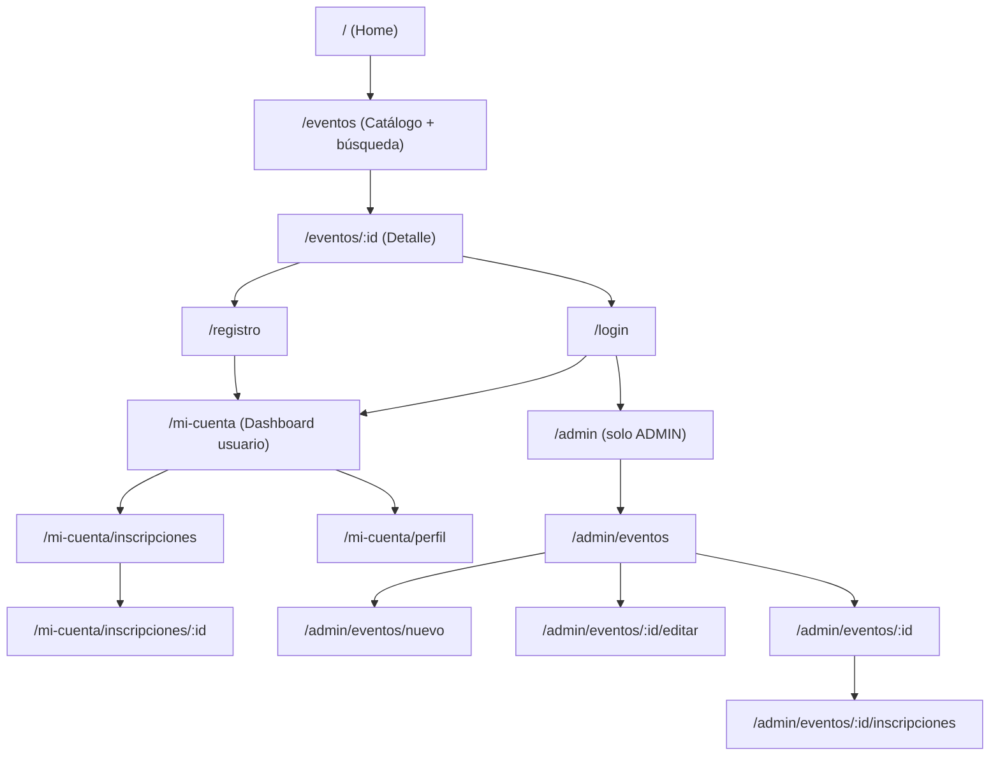

# UX & Sistema de Diseño: Event Hub

**Feature**: `001-event-hub-management`. Este documento complementa
`plan.md` § Frontend Architecture y responde a los requisitos de
identidad visual (NFR-001…NFR-013), accesibilidad (NFR-019) y a las 16
pantallas solicitadas explícitamente en la entrada de `plan`.

## 1. Identidad visual

Dirección: **bohemia, cálida, artística, contemporánea** — inspirada en
revistas editoriales de cultura, carteles de festivales y galerías, no en
un dashboard corporativo. Prioriza tipografía con carácter en titulares,
fotografía de eventos como elemento central, espacio en blanco generoso y
microinteracciones discretas. Evita glassmorphism, gradientes genéricos,
tarjetas idénticas repetidas sin variación y botones sobredimensionados.

## 2. Tokens de diseño

### 2.1 Color

| Token | Valor | Uso |
|---|---|---|
| `--color-bg-canvas` | `#FBF6EF` (crema) | fondo base de la aplicación |
| `--color-bg-surface` | `#F1E4D3` (arena) | tarjetas, paneles |
| `--color-bg-surface-alt` | `#EAD9C3` (beige) | secciones alternas, hover de fila |
| `--color-border-subtle` | `#E3D5C2` | bordes suaves, separadores |
| `--color-text-primary` | `#3B2A20` (marrón oscuro) | texto principal — contraste ≥ 8:1 sobre `--color-bg-canvas` |
| `--color-text-secondary` | `#5A4433` (marrón cálido) | texto secundario, metadatos |
| `--color-text-inverse` | `#FBF6EF` | texto sobre fondos de acento |
| `--color-accent-terracotta` | `#C1613D` | acción primaria (CTA), enlaces activos |
| `--color-accent-terracotta-hover` | `#A34E30` | hover/active de CTA |
| `--color-accent-clay` | `#D98259` | insignias, resaltes suaves |
| `--color-secondary-olive` | `#6B7A4F` | acciones secundarias, categorías, tono de éxito acompañado de ícono |
| `--color-secondary-olive-hover` | `#55613E` | hover de acción secundaria |
| `--color-success` | `#4B6B3F` | texto/ícono de confirmación (siempre + ícono, NFR-012) |
| `--color-warning` | `#A9752E` | agotado / advertencias (siempre + ícono) |
| `--color-error` | `#8C3B2E` | error de validación/negocio (siempre + ícono) |
| `--color-focus-ring` | `#3B2A20` con offset 2px | foco de teclado, visible en todos los controles |

Contraste verificado (WCAG AA, texto normal ≥ 4.5:1): `--color-text-primary`
sobre `--color-bg-canvas`/`--color-bg-surface` ≈ 11:1 y 9:1;
`--color-text-inverse` sobre `--color-accent-terracotta` ≈ 4.6:1.
Ningún estado (disponible/agotado/error/éxito) se comunica solo por color:
cada uno lleva ícono (`lucide-react`) y texto (NFR-012).

### 2.2 Tipografía

| Token | Familia | Uso |
|---|---|---|
| `--font-display` | "Fraunces" (serif editorial, variable, self-hosted) | H1–H3, nombres de evento en tarjeta/detalle, títulos de sección |
| `--font-body` | "Inter" (sans humanista, self-hosted) | párrafos, formularios, controles, tablas |
| Escala | `text-xs` 12px, `text-sm` 14px, `text-base` 16px, `text-lg` 18px, `text-xl` 22px, `text-2xl` 28px, `text-3xl` 36px, `text-4xl` 48px | line-height 1.3–1.5 según tamaño |

Ambas fuentes se sirven como archivos estáticos empaquetados en
`frontend/public/fonts` (`font-display: swap`), sin dependencia de un CDN
externo.

### 2.3 Espaciado, radio, sombra, breakpoints

| Token | Valor |
|---|---|
| `space-1..space-9` | 4, 8, 12, 16, 24, 32, 48, 64, 96 px |
| `radius-sm` | 6px (inputs, chips) |
| `radius-md` | 10px (botones) |
| `radius-lg` | 16px (tarjetas, modales) |
| `radius-pill` | 999px (badges de estado) |
| `shadow-sm` | `0 1px 2px rgba(59,42,32,0.06)` |
| `shadow-md` | `0 4px 12px rgba(59,42,32,0.08)` (única sombra usada en hover de tarjeta; nunca más pronunciada) |
| `breakpoint-sm` | 640px (tablet) |
| `breakpoint-lg` | 1024px (desktop) |

Iconografía: `lucide-react` (línea, 1.5px stroke), tamaño 16/20/24px según
contexto, siempre acompañando texto en indicadores de estado.

### 2.4 Estados de componente (transversal)

Todo componente interactivo define explícitamente: `default`, `hover`,
`focus-visible` (anillo de foco `--color-focus-ring`, nunca eliminado),
`active`, `disabled`, `loading` (spinner discreto + `aria-busy`). Las
animaciones son cortas (150–200ms, `ease-out`) y funcionales: aparición de
toast, expansión de acordeón de filtros, transición de skeleton a
contenido — nunca decorativas por sí mismas.

## 3. Arquitectura de información y navegación

**Navegación principal (header persistente)**: logo/wordmark → `/`,
enlace "Explorar eventos" → `/eventos`, buscador rápido (opcional, atajo a
`/eventos?search=`). A la derecha: si no hay sesión, botones "Iniciar
sesión" / "Crear cuenta"; si hay sesión de Usuario, menú con avatar/nombre
→ "Mi cuenta", "Mis inscripciones", "Cerrar sesión"; si hay sesión de
Administrador, el mismo menú añade "Panel de administración" y resalta la
sección activa. La navegación es idéntica en estructura para Usuario y
Administrador (NFR-013), solo cambia qué enlaces adicionales aparecen.

**User journeys**:

1. **Descubrir e inscribirse** (dorado): Home → Catálogo → Detalle →
   (si falta sesión) Login/Registro con retorno automático al detalle →
   confirmar inscripción → confirmación visual → "Mis inscripciones".
   Máximo 2 pasos desde el detalle (revisar disponibilidad → confirmar),
   SC-005.
2. **Cancelar**: Mis inscripciones → seleccionar inscripción → modal de
   confirmación explícita → cancelación → confirmación visual + cupo
   liberado reflejado en el catálogo si se vuelve a consultar.
3. **Administrar catálogo**: Panel admin → Gestión de eventos → Crear/Editar
   con formulario validado por campo → Detalle admin → Gestión de
   inscripciones del evento (conteo ocupados/disponibles en vivo).
4. **Eliminar evento con inscritos**: Gestión de eventos → Eliminar →
   modal de confirmación que muestra explícitamente "N personas inscritas
   perderán su cupo" (fetch previo a `GET /api/events/:id/registrations`)
   → confirmación final → eliminación.

## 4. Sistema de componentes (inventario reutilizable)

`frontend/src/design-system/`:

- **Átomos**: `Button` (variantes `primary` terracota, `secondary` oliva
  contorno, `ghost`, `destructive`; tamaños `sm/md`, nunca "gigante"),
  `Input`, `Select`, `Textarea`, `Checkbox`, `Badge` (estado: disponible,
  agotado, próximo, en curso, finalizado, activa, cancelada — texto +
  ícono), `Avatar`, `Spinner`, `IconButton`.
- **Moléculas**: `FormField` (label + control + mensaje de error inline,
  NFR-005), `SearchBar`, `FilterChipGroup`, `Pagination`,
  `ConfirmDialog` (usado por toda acción destructiva, NFR-011),
  `Toast`/`ToastStack` (confirmación de éxito/error, NFR-006),
  `EmptyState` (icono editorial + mensaje + acción sugerida),
  `SkeletonCard`/`SkeletonRow` (estados de carga sin *layout shift*).
- **Organismos**: `EventCard`, `EventFilterBar`, `EventForm`
  (crear/editar, comparte esquema Zod), `RegistrationRow`,
  `AdminRegistrationsTable`, `AppHeader`, `AppFooter`, `AuthForm`
  (login/registro comparten estructura).

`EventCard` (requisito explícito de la entrada de `plan`): imagen (o
ilustración de reemplazo por categoría) en proporción 4:3, nombre en
`--font-display`, fecha + hora, ubicación con ícono de pin, `Badge` de
categoría, `Badge` de disponibilidad ("12 de 30 cupos" o "Agotado" con
ícono), botón principal "Ver detalle". Hover: elevación `shadow-md` +
transición 150ms, sin recolorear toda la tarjeta.

## 5. Especificación por pantalla

Cada entrada sigue: Objetivo · Componentes · Datos · Acciones · Loading ·
Empty · Error · Success · Responsive.

### Área pública

**1. Landing / Home** (`/`)
- Objetivo: comunicar la propuesta de valor y llevar a explorar eventos en un clic.
- Componentes: hero editorial con imagen destacada, 3–4 `EventCard` de "próximos destacados", CTA "Explorar todos los eventos".
- Datos: `GET /api/events?sort=startsAt&pageSize=4`.
- Acciones: ir a `/eventos`, abrir detalle de un destacado.
- Loading: `SkeletonCard` × 4. Empty: si no hay eventos futuros, mensaje editorial + CTA a `/eventos` (catálogo vacío global). Error: banner con reintentar. Success: n/a (vista de solo lectura).
- Responsive: hero apila texto/imagen en móvil; grid de destacados 1→2→4 columnas.

**2. Exploración de eventos / Resultados de búsqueda** (`/eventos`)
- *Decisión de UX*: una sola ruta atiende tanto "explorar" como "resultados de búsqueda" (los filtros viven en la query string); evita una pantalla redundante y una transición de navegación extra, en línea con "minimizar pasos".
- Objetivo: encontrar eventos por texto/categoría/fecha/ubicación.
- Componentes: `EventFilterBar` (texto libre + categoría + fecha + ubicación, un solo paso — NFR-008), grid de `EventCard`, `Pagination`.
- Datos: `GET /api/events` con los filtros activos.
- Acciones: aplicar/limpiar filtros, paginar, abrir detalle.
- Loading: `SkeletonCard` × pageSize. Empty (sin filtros): "Aún no hay eventos publicados" + nota para administradores. Empty (con filtros): "Sin resultados para estos filtros" + botón "Limpiar filtros" (distinto del vacío global). Error: mensaje + reintentar, filtros no se pierden. Success: contador "N eventos encontrados" tras aplicar filtro (feedback de acción).
- Responsive: filtros en barra horizontal (desktop) colapsan a hoja inferior (`sheet`) en móvil; grid 1→2→3 columnas.

**3. Detalle del evento** (`/eventos/:id`)
- Objetivo: dar toda la información para decidir asistir e inscribirse en el menor número de pasos.
- Componentes: imagen destacada, título, `Badge` categoría + estado temporal, fecha/hora/ubicación con íconos, descripción completa, indicador de cupos ("18 de 30 disponibles" con barra de progreso sutil), botón principal "Inscribirme" (o "Ver mis inscripciones" si ya inscrito, o "Inicia sesión para inscribirte" si no autenticado).
- Datos: `GET /api/events/:id`; si autenticado, `GET /api/registrations/me` para saber si ya está inscrito.
- Acciones: inscribirse (paso único de confirmación, ver punto 6), ir a login/registro conservando `?from=/eventos/:id`.
- Loading: skeleton de imagen+texto. Empty: n/a. Error: `404` → "Este evento ya no está disponible" + volver al catálogo (E-006); error transitorio → reintentar. Success: tras inscribirse, banner de confirmación inline + `Toast`.
- Responsive: layout de dos columnas (imagen/info) en desktop, apilado en móvil con CTA fijo al fondo de pantalla (*sticky*) para evitar scroll extra.

**4. Login** (`/login`)
- Objetivo: iniciar sesión en el menor número de campos.
- Componentes: `AuthForm` (email, password), enlace "Crear cuenta", enlace "¿Olvidaste tu contraseña?" deshabilitado/oculto (fuera de alcance).
- Datos: ninguno previo.
- Acciones: enviar formulario → `POST /api/auth/login`; si venía de `?from=`, redirige allí tras éxito.
- Loading: botón en estado `loading` (deshabilitado, spinner). Empty: n/a. Error: mensaje genérico "Correo o contraseña incorrectos" sin precisar cuál (FR-002 acceptance #4), sin recargar la página. Success: redirección inmediata + `Toast` de bienvenida.
- Responsive: formulario centrado, ancho máximo 400px, ocupa el ancho disponible en móvil con márgenes cómodos.

**5. Registro** (`/registro`)
- Objetivo: crear cuenta con fricción mínima.
- Componentes: `AuthForm` (nombre, email, password, confirmación de password), validación en vivo (Zod) por campo.
- Datos: ninguno previo.
- Acciones: enviar → `POST /api/auth/register`; éxito inicia sesión automáticamente y redirige (o a `/login` con mensaje, a elección de implementación — se recomienda auto-login para minimizar pasos, SC-001).
- Loading: botón `loading`. Empty: n/a. Error: `409 EMAIL_IN_USE` marca el campo correo con mensaje específico sin revelar más datos de la cuenta existente (E-009); errores de formato por campo (E-001). Success: confirmación visual + redirección.
- Responsive: igual que Login.

### Área del usuario

**6. Dashboard** (`/mi-cuenta`)
- Objetivo: punto de partida personal — próximas inscripciones y acceso rápido a explorar más eventos.
- Componentes: saludo con nombre, resumen "Tienes N inscripciones activas", lista corta de próximas 3 inscripciones (tarjeta compacta), CTA "Explorar eventos".
- Datos: `GET /api/registrations/me?status=ACTIVE` (primeras 3, ordenadas por fecha).
- Loading: skeleton de lista. Empty: "Aún no tienes inscripciones" + CTA al catálogo (mismo tono que empty de Mis inscripciones pero contextual al dashboard). Error: banner + reintentar. Success: n/a.
- Responsive: tarjetas en columna única siempre (contenido breve).

**7. Mis inscripciones** (`/mi-cuenta/inscripciones`)
- Objetivo: gestionar todas las inscripciones propias.
- Componentes: pestañas o filtro "Activas / Canceladas", `RegistrationRow` (nombre de evento, fecha, ubicación, estado, acción "Cancelar" si activa y evento no iniciado).
- Datos: `GET /api/registrations/me?status=`.
- Acciones: cancelar (abre `ConfirmDialog`), abrir detalle de inscripción.
- Loading: `SkeletonRow` × 5. Empty: "Aún no te has inscrito a ningún evento" + CTA al catálogo (US4 acceptance #2). Error: banner + reintentar. Success: al cancelar, `Toast` + la fila pasa a "Cancelada" sin recargar la página completa (FR-017, actualización inmediata).
- Responsive: tabla se convierte en lista de tarjetas apiladas en móvil.

**8. Detalle de inscripción** (`/mi-cuenta/inscripciones/:id`)
- Objetivo: ver el detalle completo de una inscripción puntual y poder cancelarla.
- Componentes: datos del evento (snapshot), estado con `Badge`, fecha de inscripción/cancelación, botón "Cancelar inscripción" (si aplica).
- Datos: `GET /api/registrations/:id`.
- Acciones: cancelar (mismo flujo de confirmación que en el listado).
- Loading: skeleton. Empty: n/a. Error: `403/404` → "Esta inscripción no está disponible" + volver a Mis inscripciones (E-006, FR-020). Success: confirmación visual tras cancelar, estado se actualiza en la misma vista.
- Responsive: contenido en una columna, ancho máximo cómodo para lectura.

**9. Perfil** (`/mi-cuenta/perfil`)
- Objetivo: consultar los datos propios de la cuenta.
- Componentes: nombre, correo, rol, fecha de creación de cuenta (solo lectura en este alcance — edición de perfil no está en el alcance de `spec.md`).
- Datos: `GET /api/auth/me`.
- Loading: skeleton. Empty: n/a. Error: banner + reintentar. Success: n/a.
- Responsive: tarjeta única centrada.

### Área administrativa

**10. Dashboard administrativo** (`/admin`)
- Objetivo: vista general operativa — cuántos eventos hay, cuáles están por agotarse o comenzar pronto.
- Componentes: tarjetas resumen (total de eventos publicados, eventos próximos a 7 días, eventos con < 10% de cupo disponible), acceso directo a "Gestión de eventos".
- Datos: `GET /api/events` (agregado en el cliente sobre la página actual; sin endpoint de agregación dedicado, se mantiene simple).
- Loading: skeleton de tarjetas resumen. Empty: "Aún no hay eventos" + CTA "Crear el primer evento" (estado vacío de instalación nueva, distinto del catálogo público). Error: banner + reintentar. Success: n/a.
- Responsive: tarjetas resumen en columna en móvil, fila en desktop.

**11. Gestión de eventos** (`/admin/eventos`)
- Objetivo: CRUD completo del catálogo.
- Componentes: tabla/lista de eventos con búsqueda simple, columnas nombre/fecha/ubicación/cupos/estado, acciones por fila (Ver, Editar, Eliminar), botón "Crear evento".
- Datos: `GET /api/events` (todos, incl. finalizados, con `pageSize` mayor o paginación admin).
- Acciones: crear, editar, eliminar (con `ConfirmDialog` que advierte inscritos activos si los hay).
- Loading: `SkeletonRow`. Empty: "Aún no hay eventos" + CTA crear. Error: banner + reintentar. Success: `Toast` tras crear/editar/eliminar, fila se refleja sin recarga completa.
- Responsive: tabla con scroll horizontal contenido en móvil o colapso a tarjetas.

**12. Crear evento** (`/admin/eventos/nuevo`)
- Objetivo: publicar un evento nuevo con datos válidos en un solo formulario.
- Componentes: `EventForm` (nombre, descripción, fecha, hora, ubicación, capacidad máxima, categoría, URL de imagen opcional), validación por campo (V-001..V-005).
- Datos: ninguno previo.
- Acciones: guardar → `POST /api/events`; cancelar → vuelve a la lista sin guardar.
- Loading: botón `loading`. Empty: n/a. Error: errores por campo inline (fecha pasada, campo vacío, capacidad ≤ 0 — E-001); error de servidor → banner con reintentar conservando los datos ingresados (E-007). Success: `Toast` + redirección a detalle del evento creado (SC-006: reflejado en catálogo en menos de 1 minuto, sin pasos adicionales).
- Responsive: formulario en una columna en móvil, dos columnas (campos cortos emparejados) en desktop.

**13. Editar evento** (`/admin/eventos/:id/editar`)
- Objetivo: modificar datos de un evento existente, incluida capacidad.
- Componentes: mismo `EventForm`, precargado.
- Datos: `GET /api/events/:id`.
- Acciones: guardar → `PUT /api/events/:id`.
- Loading: skeleton de formulario mientras carga, botón `loading` al guardar. Empty: n/a. Error: igual que Crear evento, más el caso específico `409 CAPACITY_BELOW_ACTIVE_REGISTRATIONS` con mensaje explicando cuántas inscripciones activas tiene (BR-011, edge case). Success: `Toast` + refleja cambios de inmediato.
- Responsive: igual que Crear evento.

**14. Detalle del evento (vista administrativa)** (`/admin/eventos/:id`)
- Objetivo: ver el evento tal como lo vería el público más controles de gestión.
- Componentes: misma información que el detalle público + barra de acciones (Editar, Eliminar, Ver inscripciones), conteo de cupos ocupados/disponibles prominente.
- Datos: `GET /api/events/:id`.
- Acciones: navegar a editar / eliminar (con advertencia de inscritos) / inscripciones del evento.
- Loading/Empty/Error/Success: iguales que el detalle público, más `Toast` de confirmación tras eliminar tras redirigir a la lista.
- Responsive: igual que el detalle público.

**15. Gestión de inscripciones (por evento)** (`/admin/eventos/:id/inscripciones`)
- Objetivo: ver quién está inscrito y el estado de cupos de un evento específico (US6).
- Componentes: encabezado con nombre del evento y conteo "X ocupados / Y disponibles de Z", `AdminRegistrationsTable` (usuario, correo, fecha de inscripción, estado), filtro Activas/Canceladas.
- Datos: `GET /api/events/:id/registrations`.
- Loading: `SkeletonRow`. Empty: "Aún no hay inscritos en este evento" (US6 acceptance #2). Error: banner + reintentar. Success: al refrescar tras una cancelación externa, el conteo se actualiza de inmediato (US6 acceptance #3).
- Responsive: tabla colapsa a tarjetas apiladas en móvil.

## 6. Feedback, errores y estados — reglas transversales

- **Carga**: *skeletons* que preservan el layout final (evita *layout
  shift*); nunca una pantalla en blanco > 300ms percibidos.
- **Vacío**: siempre distingue "sin datos aún" (instalación nueva /
  primer uso) de "sin resultados por un filtro" (mensaje + acción para
  limpiar), con ilustración editorial discreta, no un ícono genérico de
  carpeta vacía.
- **Error**: mensaje en lenguaje llano orientado a la acción (nunca un
  código técnico crudo), con botón "Reintentar" cuando la causa es de red
  o transitoria; los datos ya escritos en un formulario nunca se pierden
  al fallar el envío (E-007).
- **Éxito**: confirmación visual inmediata (`Toast` +, cuando aplica,
  actualización inline del estado — p. ej. el contador de cupos) para
  toda acción relevante (NFR-006).
- **Confirmaciones destructivas**: `ConfirmDialog` con el detalle concreto
  de la consecuencia (p. ej. "3 personas perderán su cupo") antes de
  cancelar una inscripción o eliminar un evento (NFR-011).
- **Accesibilidad**: todos los flujos anteriores son operables por
  teclado (`Tab`/`Enter`/`Esc` cierra diálogos), roles ARIA en
  `ConfirmDialog` (`role="alertdialog"`) y `Toast` (`role="status"` /
  `role="alert"` según severidad), foco devuelto al elemento disparador
  al cerrar un modal (NFR-019).
