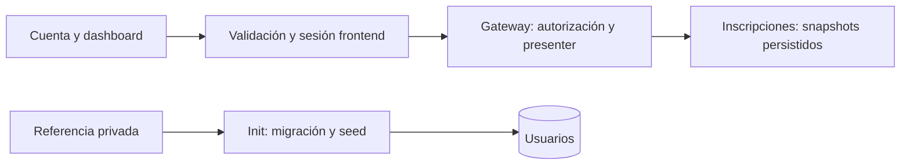

# Implementation Plan: Cuenta confiable, dashboard y administrador inicial

**Branch**: `main` (setup no creó rama) | **Date**: 2026-09-07 | **Spec**: [spec.md](spec.md)

**Input**: `specs/002-account-experience/spec.md`. Constitución 1.2.0, preset 0.4.0, perfil `openshift-dev`, entrega `orchestrated`.

## Summary

Restaurar el contrato público de inscripciones en el Gateway: envolver el listado en `{items}` y proyectar snapshots persistidos a campos públicos. Validar datos frontend, aislar errores y cachés por sesión y crear un dashboard editorial con datos reales. Ejecutar explícitamente el seed idempotente del administrador después de migraciones. Sin nuevas tablas ni servicios.

## Technical Context

**Language/Version**: TypeScript 5.x; Node.js 20 backend; React 18 frontend estático.
**Primary Dependencies**: NestJS 10, Prisma 5, bcrypt; React Router 6, TanStack Query 5, Zod, Tailwind 3, Lucide. Conservar lockfiles, sin cambiar frameworks.
**Storage**: PostgreSQL 16, tres bases existentes, sin migración de esquema.
**Testing**: Jest/Supertest, Vitest/Testing Library, Playwright Chromium integrado y capturas responsive.
**Target Platform**: OpenShift/Linux, UID arbitrario; Nginx sin privilegios en frontend.
**Project Type**: Web con cuatro servicios backend y un frontend.
**Performance Goals**: SC-005: 19/20 aperturas <3 s con 100 inscripciones; espera frontend máxima 8 s por intento, sin reintentos automáticos privados; Gateway conserva timeout 5 s.
**Constraints**: datos persistentes intactos, sin falsos vacíos, sesiones aisladas, secretos privados, entrega Pipelines/GitOps.
**Scale/Scope**: cuenta/perfil/inscripciones y vistas administrativas relacionadas, 360/768/1440 px; listado propio completo sin paginación como contrato actual.

## Constitution Check

| Gate | Antes de investigación | Después del diseño |
|---|---|---|
| Especificación y trazabilidad | PASS | PASS: matriz FR y contratos |
| Separación de responsabilidades | PASS | PASS: diseño local; entrega posterior administrada |
| Topología real por workload | PASS | PASS: cinco workloads y tres bases |
| Seguridad y datos | PASS | PASS: permisos antes de proyección, seed sin sobrescritura |
| Entrega declarativa | PASS | PASS: digests y sondas existentes conservados |
| Secretos y acceso inicial | PASS de diseño | PASS de diseño; handoff efectivo PENDING_VALIDATION |
| Gobernanza inmutable | PASS | PASS: sin cambios a constitución ni plataforma |

No hay aclaraciones funcionales o de arquitectura pendientes. Validar el canal privado y acceso real del administrador es un gate operativo de entrega; no se declara cumplido durante plan.

## Project Structure

### Documentation (this feature)

`specs/002-account-experience/`: spec.md, plan.md, research.md, data-model.md, ux-design.md, quickstart.md, contracts/account-api.md, contracts/admin-bootstrap.md. tasks.md se genera posteriormente.

### Source Code (repository root)

- `backend/api-gateway/src/registrations/`: presenter, validación y controladores; `test/registrations.e2e-spec.ts` con fixtures internos reales.
- `backend/user-service/src/bootstrap/`: seed reutilizable y ejecutable compilado; `prisma/seed.ts` como CLI compatible; pruebas en `test/`.
- `frontend/src/services/`: schemas, cliente abortable; `src/app/`: sesión, guards, router/boundaries; `src/features/dashboard/`, `registrations/`, `admin/`: vistas/pruebas.
- `frontend/src/design-system/`: Avatar, estados y formateadores seguros; `frontend/e2e/` y `playwright.config.ts`: integración y destino parametrizado.
- `deploy/openshift/base/user-service/deployment.yaml`: segundo initContainer; `backend/user-service/Containerfile`: ejecutable compilado. `.sdd/workloads.yaml` se reconcilia en implement sin cambiar topología.
- `docs/operations/openshift-deployment.md`: evidencia y entrega de acceso sin valores sensibles.

**Structure Decision**: extender arquitectura existente, sin nuevo servicio de resúmenes, endpoint público de bootstrap ni monorepo compartido.

## Arquitectura y contratos

Evidencia adicional de implement (recorrido UI real de FR-015): event-service entrega temporalStatus en minúsculas, frontend compara mayúsculas e impedía inscribirse a eventos futuros. Adaptar/validar ese enum en el cliente HTTP de eventos, sin cambiar las reglas internas ni su contrato. La prueba de regresión exige que `upcoming` habilite el flujo de inscripción; completar esta corrección dentro de T013/T022/T047.

El dashboard solicita todas las inscripciones propias, deriva conteos por estado y top 3 de futuras por fecha/id. Sin N+1 al catálogo: snapshots preservan historia incluso si se elimina el evento. Autorización de detalle/cancelación ocurre sobre registro interno antes de eliminar userId de la proyección pública.

Zod diferencia corrupción esencial (error) y metadata inválida (null con etiqueta). Queries privadas incluyen userId y generación de sesión, habilitadas solo al autenticar. Transición de identidad: incrementar generación, cancelar solicitudes y retirar cachés privadas. Ignorar respuestas/toasts de generaciones anteriores. 401 vigente invalida sesión y guarda `from` interno validado; 403 no cierra sesión. Un fallo de red al resolver sesión ofrece recuperación, no falsa sesión inválida.

Boundaries de rutas hijas conservan shell; fallback raíz independiente ofrece navegación segura sin traza visible. Reintento de consulta conserva filtro; fallo de render ofrece salida segura o recarga explícita.

## Workloads y realización OpenShift

| Componente | Tecnología | Runtime/acceso | Delta / imagen / salud |
|---|---|---|---|
| frontend | React18/Vite, Nginx estático | Deployment/frontend; Service:8080; Route/event-hub | MODIFIED; IMAGE_FRONTEND; /healthz |
| api-gateway | Node20/NestJS10 | Deployment/api-gateway; Service:3000 interno | MODIFIED; IMAGE_API_GATEWAY; /healthz,/readyz |
| user-service | Node20/NestJS10/Prisma5 | Deployment/user-service; Service:3000 interno | MODIFIED; IMAGE_USER_SERVICE; /internal/healthz,/internal/readyz |
| event-service | Node20/NestJS10/Prisma5 | Deployment/event-service; Service:3000 interno | UNCHANGED; IMAGE_EVENT_SERVICE; sondas internas existentes |
| registration-service | Node20/NestJS10/Prisma5 | Deployment/registration-service; Service:3000 interno | UNCHANGED; IMAGE_REGISTRATION_SERVICE; sondas internas existentes |
| db-users/events/registrations | PostgreSQL16 | Tres StatefulSets, Services:5432 y PVC propios | UNCHANGED; pg_isready |

Contextos de imagen: frontend y backend/<servicio>, Containerfile independiente. El schema de workloads admite Deployment/StatefulSet; seed es proceso finito dentro del Deployment/user-service, sin Job ajeno al contrato.

## Project, seguridad y red

Project `event-hub-dev`, CI `event-hub-ci`, propietario `group:default/developers` (PROFILED). Conservar cuotas, límites, réplicas y RBAC administrados; valores efectivos PENDING_VALIDATION. Aplicación sin permisos administrativos. Seed recibe solo conexión a db-users y referencia `user-service-seed-admin` email/password; retirar esas entradas del contenedor HTTP si ya no las usa.

Conservar router→frontend→Gateway→servicios, registration→event y servicio→su base. Seed comparte labels/red user-service, sin egress nuevo. runAsNonRoot, UID arbitrario, capabilities ALL eliminadas, allowPrivilegeEscalation false, recursos seed iniciales 100m/128Mi requests y 500m/256Mi limits. Revisar root filesystem read-only según escrituras del runtime, sin añadir privilegios.

## Datos, bootstrap, backup y rollback

Sin nuevas tablas. Segundo initContainer tras migrate: `node dist/bootstrap/seed-admin.js`; código dentro de src para que tsconfig actual lo compile. CLI db:seed utiliza misma lógica. Normalizar email como registro/login. ADMIN existente conserva perfil/hash; verificar password configurada antes de afirmar acceso. USER existente produce conflicto, sin elevar rol. Colisión concurrente P2002: releer y comprobar rol/credencial; no reset automático.

Backup/retención/restauración vigentes se conservan. Pruebas solo sobre datos sintéticos identificados. Rollback GitOps de imágenes/configuración no elimina al administrador creado ni datos existentes. No restaurar arrays públicos crudos como compatibilidad: el contrato correcto ya estaba especificado.

## Trazabilidad y verificación

| Requisitos | Diseño | Evidencia |
|---|---|---|
| FR-001,002,005 | presenter, schemas, formatos, boundaries | Jest/Vitest: malformed/null/fechas + E2E recuperación |
| FR-003,011 | guards, generación, cancelación, from | 401/403, A→B con respuesta tardía, URL directa |
| FR-004,008 | DTO creación/detalle/cancelación e invalidación | flujo real alta→lista→detalle→cancelar→resumen |
| FR-006,007 | selector sobre colección completa | 0/1/21/100 mixtos, empates/fechas inválidas |
| FR-009,010 | ux-design y componentes existentes | capturas, teclado, contraste y reduced-motion |
| FR-012–014 | seed compilado y referencias privadas | DB desechable: nuevo/existente/concurrente/conflicto; login ADMIN y handoff |
| FR-015, SC-001–007 | integración real y matrices de casos | reportes E2E, tiempos y entrega verificable |

## CI, promoción, documentación y paridad

Lint/build de workloads modificados; Jest Gateway/user-service; integración con bases desechables; Vitest/Playwright. Renderizar base/dev y Conftest; comprobar secretos, referencias, digests sin duplicación, OpenSSL y sondas corregidas previamente. Documentar commit/digests/revisión GitOps/fecha/evidencia/URL y acceso privado sin valores.

`sdd.deliver`: preflight→publish→watch, orquestador construye/promociona/verifica. Fuentes en este repo; `gitops/apps/event-hub` en repo de plataforma es copia promocionada por automatización. No nuevos Pipelines/Applications ni despliegue directo. Infraestructura saludable no sustituye pruebas de cuenta.

Paridad funcional local/dev: mismos DTO, reglas, seed; cambian TLS/puertos y origen de secretos. Corregir guía que afirma que migrate deploy ejecuta seed o que npm test cubre suites de test/.

## Riesgos, procedencia y pendientes

- INFERRED: contrato/presenter/seed desde código real. DEFAULTED: timeout 8s y composición. PROFILED: Projects y flujo. SECRET_REFERENCE: seed y bases existentes.
- PENDING_VALIDATION: estado/rol/password del administrador, capacidad efectiva de handoff privado (plataforma/broker), recursos reales, rendimiento, smoke, recuperación. No leer secretos en plan ni inventar mecanismo privado existente.
- Listado completo adecuado a escala aceptada; paginación futura deberá conservar agregados completos.
- Transición: Gateway compatible con frontend anterior se entrega antes que frontend nuevo; clientes abiertos deben recuperar errores, nunca mostrar vacío falso.

## Secuencia para tasks

1. Fixtures reales/pruebas que reproduzcan array y snapshots.
2. Presenter, schemas, fechas/Avatar seguros y regresión administrativa.
3. Sesión aislada, señales/timeout, guards/boundaries.
4. Selector de resumen y dashboard/estados responsive.
5. Seed compilado, concurrencia/conflictos y initContainer.
6. Integración, visual, políticas, documentación y entrega administrada con handoff privado.

## Complexity Tracking

## Delta 2026-09-08: catálogo y evidencia de entrega

FR-016/017: migración de datos aditiva en event-service, sin cambio de esquema ni nuevo workload. Insertar 12 UUID deterministas con `ON CONFLICT (id) DO NOTHING`; fechas UTC calculadas una sola vez respecto a la ejecución (14–91 días). Nombre y descripción identifican Demo, sin imágenes remotas ni ubicaciones reales inventadas. El initContainer migrate existente aplica la migración versionada desde la misma imagen Prisma. No se reponen eventos eliminados ni cupos en reinicios: Prisma registra la ejecución. Rollback de imagen no elimina datos; eliminación posterior solo mediante administración autorizada.

FR-018: `tools/sdd-deliver.sh watch` compara `sourceCommitSha` con HEAD fijado al comenzar; un SUCCEEDED distinto o sin SHA termina con código 21 y trazabilidad, nunca falso éxito. Un éxito de SHA vigente sin Route HTTPS termina con código 22. Usar jq para JSON compacto o indentado. No modificar controlador, Secrets ni estado GitOps de plataforma.

Pruebas: SQL real en PostgreSQL local, esquema aleatorio transaccional con ROLLBACK, repetición y preservación de registros/cupos/fechas; regresiones de watch con funciones de estado simuladas sin red; suites frontend/Gateway y recorrido login→cuenta→inscripción. Entrega y población remotas quedan PENDING_VALIDATION hasta evidencia del commit nuevo. Producción: PLATFORM_INPUT_REQUIRED, propietario plataforma, falta perfil/destino/capacidad de promoción aprobados.

Sin violaciones justificadas ni nueva infraestructura. tasks.md corresponde a la siguiente fase.
